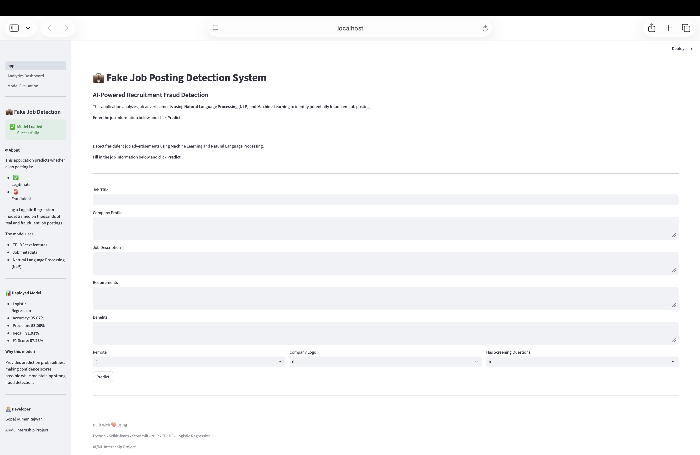
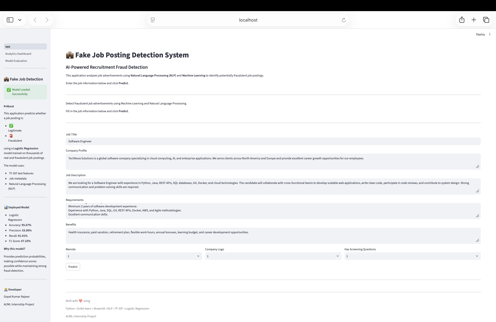
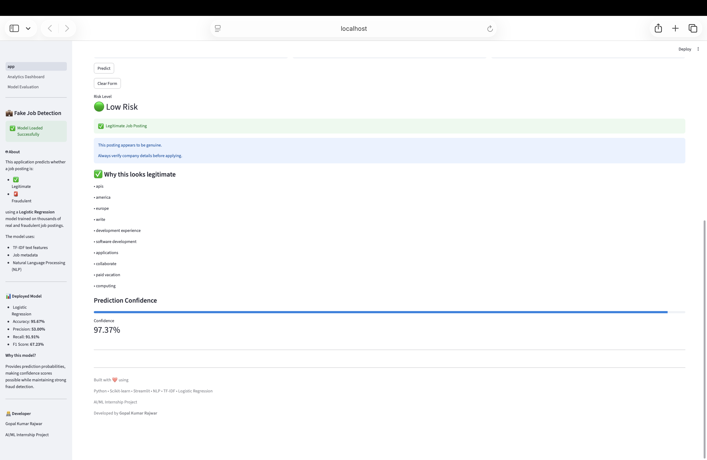
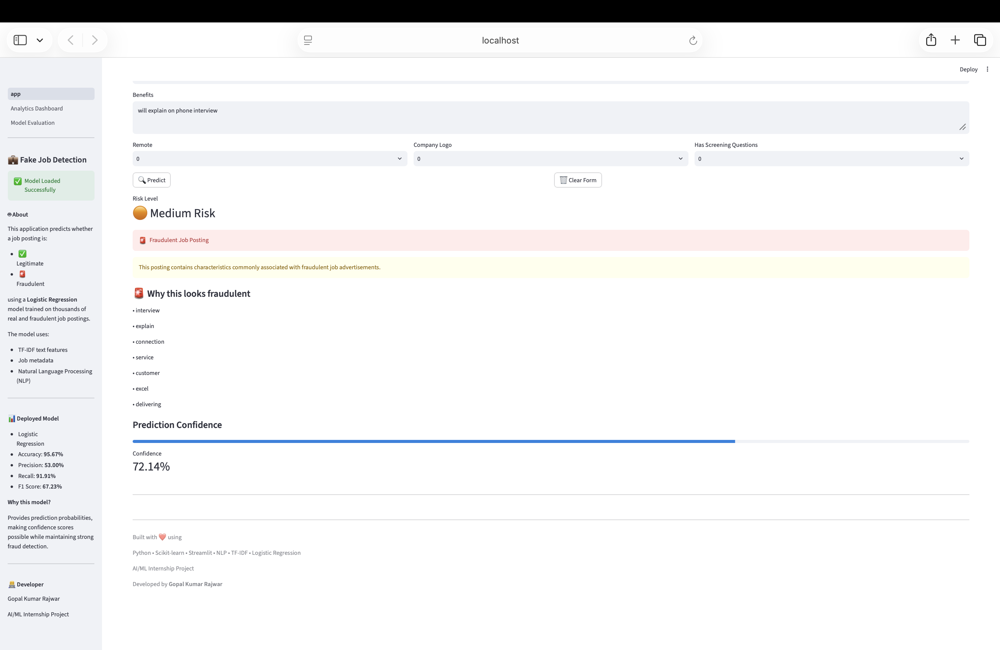
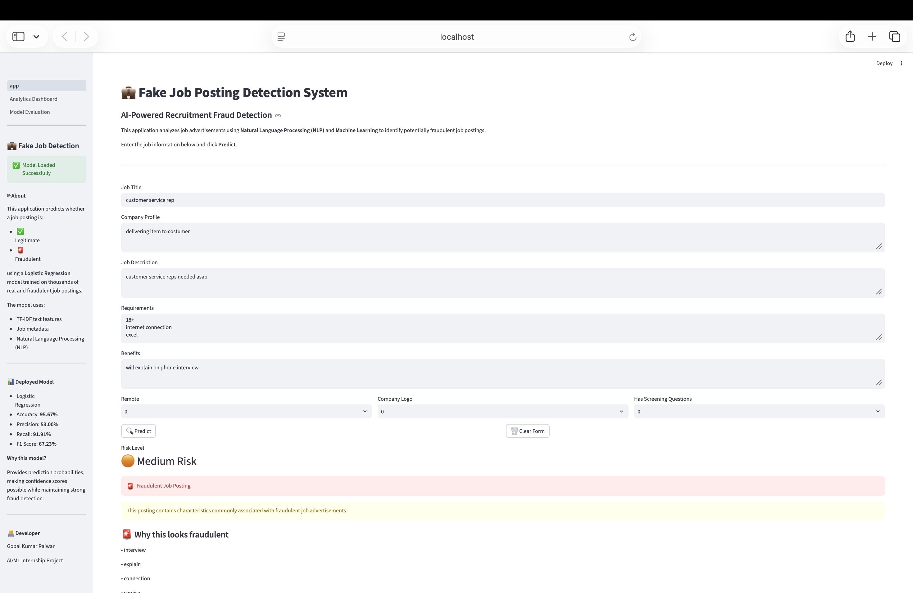
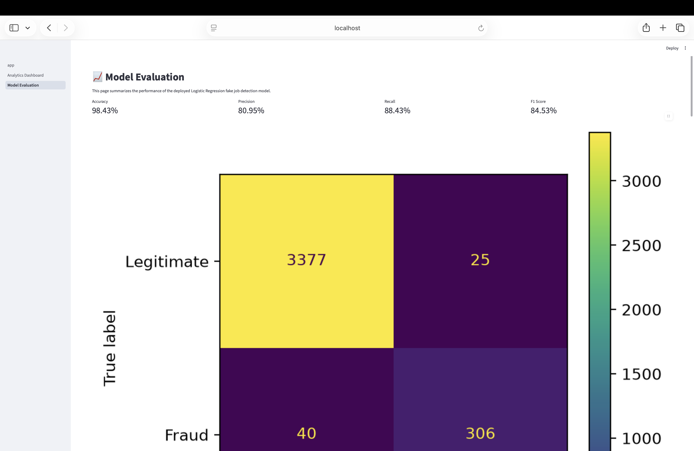
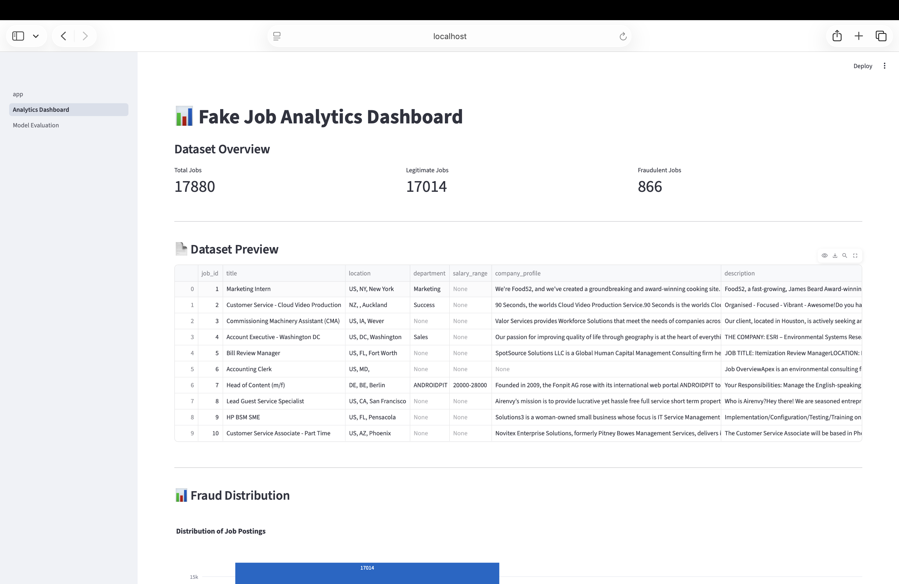

# 💼 Fake Job Posting Detection System


An end-to-end **Machine Learning** and **Natural Language Processing (NLP)** project that detects fraudulent job advertisements using **Logistic Regression** and **TF-IDF** text features.

The application provides an interactive **Streamlit** interface where users can enter job posting details and receive:

- ✅ Prediction (Legitimate or Fraudulent)
- 📊 Prediction Confidence
- 🚨 Risk Level
- 🔍 Prediction Explanation

---

# 📌 Table of Contents

- Project Overview
- Project Objectives
- Features
- Project Structure
- Dataset
- Technologies Used
- Machine Learning Model
- Model Performance
- Application pages
- Application Screenshots
- Installation
- Run on Windows
- Run on macOS
- Future Improvements
- Author/Developer
- License

---

# 📖 Project Overview

Online recruitment fraud has become increasingly common, making it difficult for job seekers to identify genuine opportunities.

This project leverages **Natural Language Processing (NLP)** and **Machine Learning** to classify job advertisements as either:

- ✅ Legitimate
- 🚨 Fraudulent

The model analyzes both textual content and structured job attributes to identify suspicious patterns commonly found in fake job postings.

## 🎯 Project Objectives

- Detect fake job advertisements using NLP.
- Compare multiple machine learning algorithms.
- Deploy the best-performing model as a web application.
- Provide prediction confidence and explainability.
- Help job seekers identify potentially fraudulent job postings.
---

## 📌 Features

- 🔍 Detects whether a job posting is **Legitimate** or **Fraudulent**
- 🤖 Machine Learning model using Logistic Regression
- 📝 NLP preprocessing with TF-IDF Vectorization
- 📊 Prediction confidence score
- 🧠 SHAP Explainability for model interpretation
- 📈 Analytics Dashboard with dataset insights
- 📉 Model Evaluation page
- 📊 Confusion Matrix
- 📈 ROC Curve
- 📉 Precision–Recall Curve
- 🌐 Interactive Streamlit Web Application

---

## 📂 Project Structure

```
Fake_Job_Detection/
│
├── app/
│   ├── assets/
│   ├── pages/
│   │   ├── 1_Analytics_Dashboard.py
│   │   └── 2_Model_Evaluation.py
│   ├── app.py
│   ├── utils.py
│   └── shap_utils.py
│
├── data/
│   ├── raw/
│   └── processed/
│
├── models/
│   ├── best_model.pkl
│   └── tfidf_vectorizer.pkl
│
├── notebooks/
│   ├── 01_Data_Exploration.ipynb
│   ├── 02_Preprocessing.ipynb
│   ├── 03_Model_Training.ipynb
│   ├── 04_Model_Comparison.ipynb
│   ├── 05_Model_Interpretation.ipynb
│   ├── 06_SHAP_Explainability.ipynb
│   └── 07_Model_Evaluation_Plots.ipynb
│
├── reports/
│
├── requirements.txt
├── README.md
└── .gitignore
```

---

## 📊 Dataset

Dataset used:

**Fake Job Postings Dataset**

- Total Records: **17,880**
- Legitimate Jobs: **17,014**
- Fraudulent Jobs: **866**

---

## 🛠 Technologies Used

- Python
- Pandas
- NumPy
- Scikit-learn
- NLTK
- SHAP
- Matplotlib
- Plotly
- Streamlit
- Joblib

---

## 🤖 Machine Learning Model

**Model Used**

- Logistic Regression

**Feature Engineering**

- TF-IDF Vectorization
- Structured Features
  - Remote
  - Company Logo
  - Screening Questions

---

## 📊 Model Performance

| Metric | Score |
|---------|-------|
| Accuracy | 95.67% |
| Precision | 53.00% |
| Recall | 91.91% |
| F1 Score | 67.23% |

The deployed model prioritizes fraud detection by achieving high recall while maintaining strong overall accuracy.

---

## 🖥 Application Pages

### 🏠 Home

- Predict Fake Job Posting
- Prediction Confidence
- Fraud Indicators
- Legitimate Indicators
- SHAP Explanation

---

### 📊 Analytics Dashboard

- Dataset Overview
- Fraud Distribution
- Employment Type Analysis
- Interactive Charts

---

### 📈 Model Evaluation

- Confusion Matrix
- ROC Curve
- Precision–Recall Curve
- Classification Report
- Top Important Features

---

# 📸 Application Screenshots

## 🏠 Home Page

The home page provides an intuitive interface where users can enter job posting details for analysis.



---

## ✅ Legitimate Job Prediction - Input

A sample legitimate job advertisement entered into the application before prediction.



---

## ✅ Legitimate Job Prediction - Output

The Logistic Regression model classifies the job posting as **Legitimate**, along with the prediction confidence, risk level, and explanation.



---

## 🚨 Fraudulent Job Prediction - Input

A suspicious job posting entered into the application for fraud detection.



---

## 🚨 Fraudulent Job Prediction - Output

The model successfully identifies the job posting as **Fraudulent** and displays the confidence score, risk level, and key indicators contributing to the prediction.



---

## 📈 Model Evaluation Dashboard

This page summarizes the performance of the deployed Logistic Regression model using evaluation metrics such as Accuracy, Precision, Recall, F1 Score, Confusion Matrix, and Classification Report.



---

## 📊 Analytics Dashboard

The Analytics Dashboard provides insights into the dataset through visualizations, helping users understand the distribution of legitimate and fraudulent job postings and other key characteristics of the data.



---

```

---

## 🚀 Installation

Clone the repository

```bash
git clone https://github.com/Levisquad01/Fake_Job_Detection.git
```

Move into the project directory

```bash
cd Fake_Job_Detection
```

---

## 💻 Running on macOS

### 1. Create Virtual Environment

```bash
python3 -m venv .venv
```

### 2. Activate Environment

```bash
source .venv/bin/activate
```

### 3. Install Dependencies

```bash
pip install -r requirements.txt
```

### 4. Run Streamlit

```bash
streamlit run app/app.py
```

Open:

```
http://localhost:8501
```

---

## 💻 Running on Windows

### 1. Create Virtual Environment

```cmd
python -m venv .venv
```

### 2. Activate Environment

**Command Prompt**

```cmd
.venv\Scripts\activate
```

**PowerShell**

```powershell
.venv\Scripts\Activate.ps1
```

### 3. Install Dependencies

```cmd
pip install -r requirements.txt
```

### 4. Run Streamlit

```cmd
streamlit run app/app.py
```

Open:

```
http://localhost:8501
```

---

## 🧠 Future Improvements

- Deep Learning Models (LSTM, BERT)
- Real-time API Integration
- Resume Matching
- Company Reputation Verification
- Cloud Deployment
- User Authentication

---

## 👨‍💻 Developer

**Gopal Kumar Rajwar**

AI/ML Internship Project

---

## 📄 License

This project is developed for educational and internship purposes.